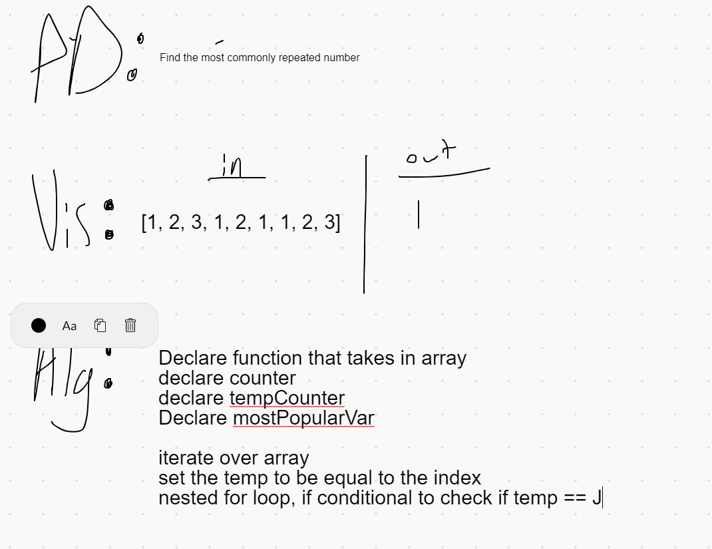
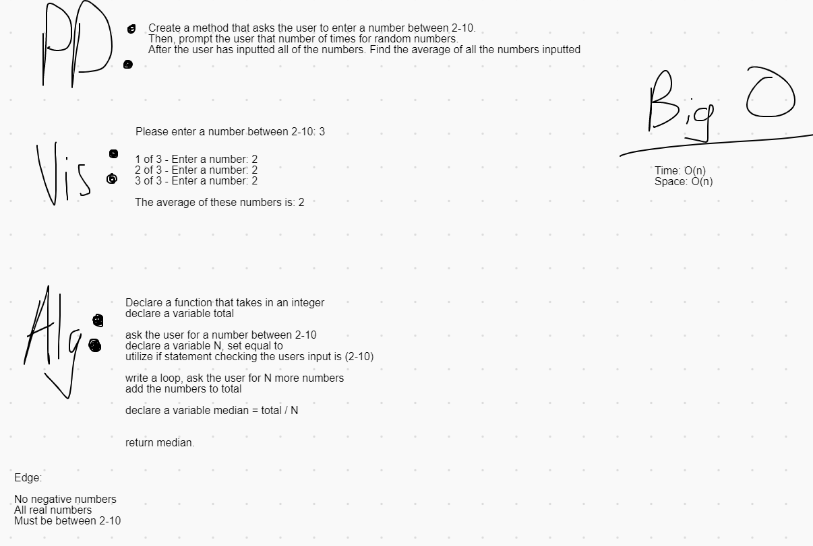

# Lab03

**Author**: Matthew Petersen
**Version**: 1.0.0 

## Overview
Complete 7 different challenges, at 30 minutes per challenge! Ready....Set.....CODE!

## Getting Started
Git clone [Repository.clone.goes.here]

Now that it's on your local machine, fire up VS Code!

Once you are in VS Code, hit the green play button at the top and go through all the prompts.

## Example

## Architecture
C# and VSC

## Change Log
01/13/2021 - Initial upload
